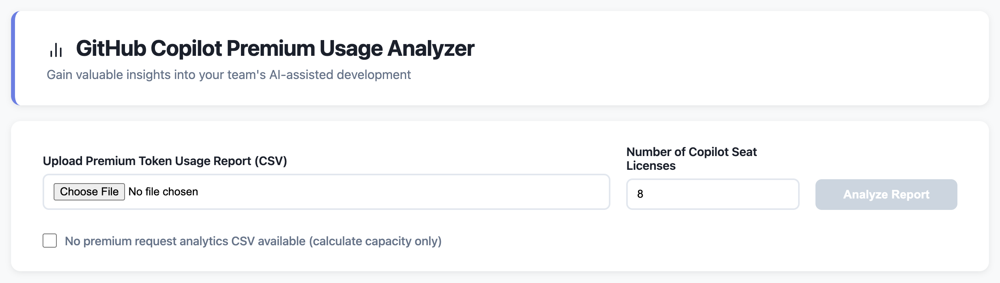
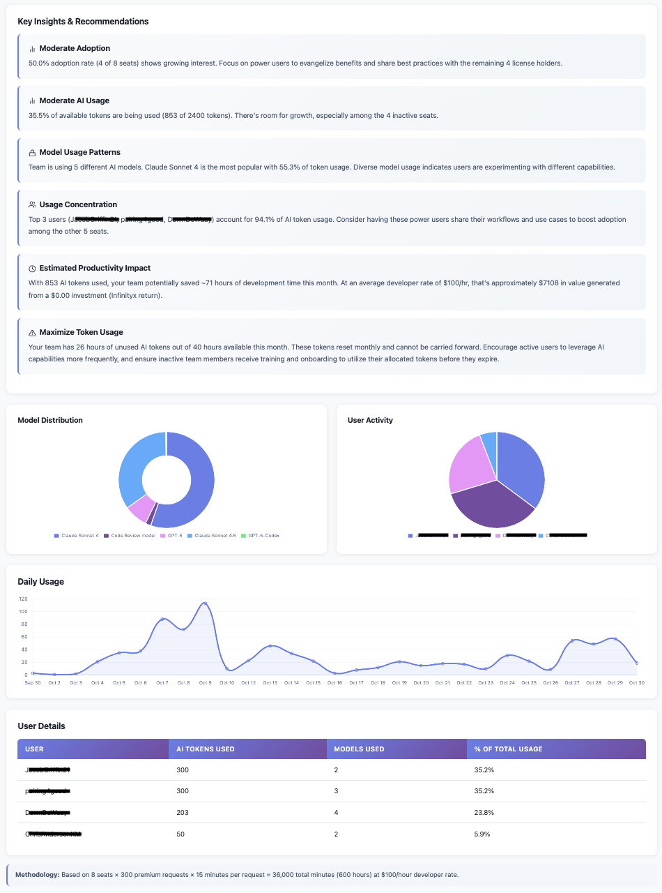

# GitHub Copilot Premium Usage Analyzer

Measure the ROI of your GitHub Copilot Premium investment. This analytics tool helps engineering leaders track AI capacity utilization, adoption rates, and productivity gains across their development teams.

## 🚀 Getting Started

**Use instantly online:** https://pairing4good.github.io/copilot-premium-usage-analyzer/

**Or run locally:** Download `index.html` and the `src` folder, then open `index.html` in any browser.

> **🔒 Privacy First:** This tool runs 100% in your browser. No data is sent to servers. Your usage reports stay on your machine.

### How to Use

1. **Export your usage report** from GitHub (Settings → Billing → Usage Reports → Premium Request Usage Report CSV)
2. **Open the tool** in your browser
3. **Upload your CSV** and enter your number of Copilot seat licenses
4. **Set your developer hourly rate** (defaults to $100/hr - adjust to your actual cost)
5. **Click "Analyze Report"** to see your dashboard

**Don't have usage data yet?** Check "No premium request analytics CSV available" to calculate your total AI capacity potential based on seat count alone.

## 💡 Why This Tool Matters

GitHub Copilot Premium is a **pre-paid capacity investment**. Each developer license includes **300 premium requests per month**—equivalent to **75 hours of AI-assisted development capacity**.

### What Are Premium Requests?

Premium requests power **GitHub Copilot Chat** and autonomous agent features that go far beyond basic code completion:

**AI Pair Programming**
- Ask complex questions about unfamiliar codebases
- Generate functions, classes, or entire modules from descriptions
- Debug through conversational troubleshooting
- Refactor code with intelligent suggestions
- Write comprehensive tests automatically

**Autonomous Agent Features**
- **Copilot Code Review:** Automated pull request analysis with security scanning and actionable feedback
- **Copilot Coding Agent:** Assign issues directly to @copilot to handle bug fixes, features, and refactoring independently

**Advanced Capabilities**
- Multi-file code generation with repository-wide context
- Access to premium AI models (GPT-4, Claude 3.5 Sonnet)
- Documentation generation and code reviews
- Interactive debugging and explanations

### The Critical Question: Are Premium Features Enabled?

**Premium features are disabled by default.** Even if your organization pays for Premium licenses, developers cannot access these capabilities until explicitly enabled by administrators.

**If premium features are disabled:**
- ❌ Developers only get basic autocomplete
- ❌ No access to Copilot Chat or advanced AI assistance
- ❌ **You're paying for Premium but receiving Standard value**
- ❌ **300 requests per developer per month go completely unused**

> **⚠️ ROI Reality Check**  
> A team of 10 developers with unused quotas = **3,000 requests (750 hours) of pre-paid AI capacity lost every month.** This analyzer helps you identify if you're leaving this productivity on the table.

### How to Enable Premium Features

Organization administrators should:
1. Enable "Copilot Chat in the IDE" in GitHub organization settings
2. Enable access to premium AI models
3. Communicate availability to developers
4. Use this analyzer to track adoption and ROI

## 📊 What You'll Measure

### AI Usage Metrics
- **Premium Requests Used:** Total AI interactions across your team
- **Adoption Rate:** Percentage of licenses actively using premium features
- **Utilization Rate:** Percentage of available AI capacity consumed

### AI Developer Capacity
- **Total Opportunity:** Total AI hours included in your licenses (75 hours × number of seats)
- **Capacity Used:** AI hours your team actually leveraged
- **Unused Potential:** Pre-paid AI hours going unused each month

> **Calculation:** 1 Premium Request = 15 minutes of AI-assisted development capacity  
> **Example:** 10 seats × 300 requests × 15 minutes = **750 hours/month of AI capacity**

### Financial Impact
All capacity metrics translate to dollar values using your specified developer hourly rate, showing:
- Total value of your AI investment
- Actual ROI from premium features
- Cost of unused capacity (lost monthly)

### Additional Insights
- **AI-generated recommendations** for improving adoption and utilization
- **Model distribution** showing which AI models your team prefers
- **Top users** leveraging premium features most effectively
- **Daily usage trends** to identify patterns
- **Agent feature detection** highlighting autonomous Code Review and Coding Agent usage

## 🎯 Unlocking Organizational Value

### For Engineering Leaders

**Optimize your investment:**
- Identify unused licenses for reallocation
- Track adoption trends month-over-month
- Target low-adoption teams for enablement

**Demonstrate ROI:**
- Show dollar value of AI capacity utilized
- Quantify productivity gains in business terms
- Justify continued or expanded investment

**Drive adoption:**
- Identify power users to champion best practices
- Share success patterns across teams
- Focus training where it matters most

### For Executives

**Strategic insights:**
- Measure cost per unit of value delivered
- Forecast capacity needs based on usage trends
- Make data-driven decisions about scaling AI tools
- Benchmark utilization across departments

**Executive reporting:**
- Clean, printable dashboards for board meetings
- Clear ROI metrics aligned to business outcomes
- Identify opportunities to maximize existing investment

## ⚙️ How It Works

This tool converts GitHub's Premium Request Usage Report into actionable metrics using a simple calculation:

**300 premium requests × 15 minutes per request = 75 hours of AI capacity per developer per month**

This represents virtual developer capacity added to your team—AI assistance handling work that would otherwise require manual effort.

> **Example:** A team of 10 developers = **750 hours/month of AI-assisted development capacity** included in your Premium licenses.

### Key Calculations

**Adoption Rate:** (Active Users ÷ Total Seats) × 100  
**Utilization Rate:** (Requests Used ÷ Total Available Requests) × 100  
**Capacity Used:** Requests Used × 15 minutes ÷ 60  
**Dollar Value:** Hours × Your Developer Hourly Rate

### Validation Note

The 15-minute metric is validated through real-world development case studies (see `CASE_STUDY_METRICS.md`), representing a conservative estimate of actual value delivered.

## 📋 Requirements

**CSV Format:** GitHub's standard Premium Request Usage Report export

**Required columns:** username, quantity, model, date, net_amount, total_monthly_quota

**Seat Count:** Must equal or exceed the number of unique users in your CSV file

**Browser:** Chrome/Edge 90+, Firefox 88+, or Safari 14+

## ⚠️ Important to Know

**Premium requests reset monthly.** Unused capacity cannot be carried forward and is lost at billing cycle end. This tool highlights this opportunity cost.

**Mid-month reports are valid.** "Unused Potential" shows what remains available in the current month.

**Customize your developer rate.** Enter your actual hourly cost (salary + benefits + overhead) for accurate financial metrics. Default is $100/hour.

**Directional insights, not absolute truth.** Use metrics to identify trends and opportunities. Actual productivity impact varies by task complexity and developer experience.

## 🔒 Privacy & Security

- **100% client-side processing** - all calculations run in your browser
- **No data transmission** - nothing sent to servers
- **No tracking or analytics** - your usage data stays private
- **Safe for sensitive data** - use confidently with organizational information

## 💡 Best Practices

**Run monthly** to track adoption trends and measure training impact

**Export key metrics** each month to visualize progress over time

**Use insights for team discussions** about AI adoption barriers and success patterns

**Celebrate wins** by sharing power user workflows and high adopter achievements

**Set realistic benchmarks:**
- 0-30% adoption: Needs immediate attention
- 30-60% adoption: Room for improvement  
- 60%+ adoption: Strong performance, focus on optimization

## 📞 Support

For questions or issues, open a GitHub issue in this repository.

---

**Built with AI:** This tool was developed using GitHub Copilot, demonstrating the power of AI-assisted development for creating production-ready applications.

**License:** MIT - See LICENSE file for details
